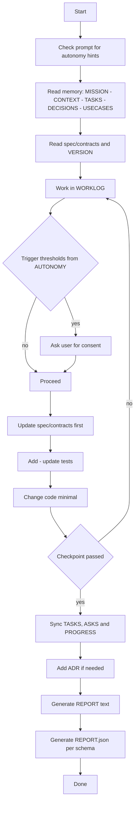

# Codex Cloud AGENTS.md+ Memory Bank (optimized)

Агент для Codex Cloud в стиле SDD: **Contracts → Tests → Code → ADR → Progress**, с расширенным мемори‑банком `.memory/` и гибкими правилами автономности (по умолчанию — уровень 2).


## Первый старт и вокрфлоу

1. Прочитай `AGENTS.md`, чтобы понять правила автономности и воркфлоу агента в связке с мембанком.
2. Заполни ручками фалы миссия `MISSION.md`, контекст `CONTEXT.md`, глоссарий `GLOSSARY.md`, и примеры клиентского использования твоего проекта`USECASES.md`.Можно попросить LLM заполнить их на основании уже существующего проекта. 
3. Далее можно начинать работать. Агент будет обновлять по ходу работы:
 - `WORKLOG.md` - это атомарные действия агента между чекпоинтами.
 - `PROGRESS.md`, `ASKS.md`, `DECISIONS.md`: фикс чекпоинтов, т.е. глобального прогресса.
4. Придерживайся ритуала SDD разработки: цикл **Contracts → Tests → Code → ADR → Progress**. Если спеков еще нет, потрать как можно больше времени на их генерацию (можно просить Агента, он поможет) и многократную проверку на: консистентность, логические ошибки, завершенность и полноту. 
5. Cледующая фаза: разработать выверенный роадмап и заполнить файл `TASKS.md`.
5. Если все необходимые спеки будут сгенерированы, генерация кода согласно `TASKS.md` занимает минимум времени. Следующая крупная фаза: Тесты.


## Дерево проекта

```text
.
├── spec/
│   ├── contracts/
│   │   └── VERSION.json
│   ├── adr/
│   │   └── ADR-0001.md
│   └── docs/
│       └── blueprints/
├── AGENTS.md
└── .memory/
    ├── ASKS.md
    ├── AUTONOMY.md
    ├── CONTEXT.md
    ├── DECISIONS.md
    ├── GLOSSARY.md
    ├── INDEX.yaml
    ├── MISSION.md
    ├── PROGRESS.md
    ├── REPORT_SCHEMA.json
    ├── REPORT_TEMPLATE.md
    ├── TASKS.md
    ├── USECASES.md
    └── WORKLOG.md
```

`spec/adr/` — каноничное хранилище ADR (архитектурных решений). `spec/docs/blueprints/` хранит схемы и макеты, на которые могут ссылаться ADR и контракты.

## Как это работает — кратко

1. Codex читает `AGENTS.md` и определяет режим автономности: если в запросе явно указан уровень 0/1 — следует ему, иначе работает в уровне 2.
2. Читает `.memory/*`, `spec/contracts/*` и `spec/adr/*`, следует ритуалу **Contracts → Tests → Code**.
3. Ведёт черновик шагов в `WORKLOG.md` до checkpoint.
4. Если меняются публичные интерфейсы — сначала правит `spec/contracts/*` и версии в `spec/contracts/VERSION.json` по SemVer.
5. После checkpoint синхронизирует `TASKS.md`, `ASKS.md`, `PROGRESS.md`; оформляет ADR в `spec/adr/ADR-XXXX.md` и обновляет индекс `.memory/DECISIONS.md`.
6. Возвращает финальный ответ по шаблону `REPORT_TEMPLATE.md` и прикладывает `REPORT.json` по схеме `REPORT_SCHEMA.json`.


## Mermaid диаграмма процесса



## Быстрый чек‑лист

* Перед началом: определи автономность (по умолчанию — 2), прочитай `.memory/*`, `spec/contracts/*` и `spec/adr/*`.
* Любые изменения публичных интерфейсов — сначала `spec/contracts/*` и SemVer.
* До checkpoint пиши только в `WORKLOG.md`; после — синхронизируй `TASKS.md`, `ASKS.md`, `PROGRESS.md`, ADR в `spec/adr/` и индекс `.memory/DECISIONS.md`.
* Всегда формируй финальный отчёт: текст + `REPORT.json`.

## Политика PR (сверхкратко)

* Один PR — одна цель; unit + contract тесты зелёные; контракты/ADR/прогресс обновлены.
* В описании PR: цель, влияние на API и данные, риски, план отката, миграции.
